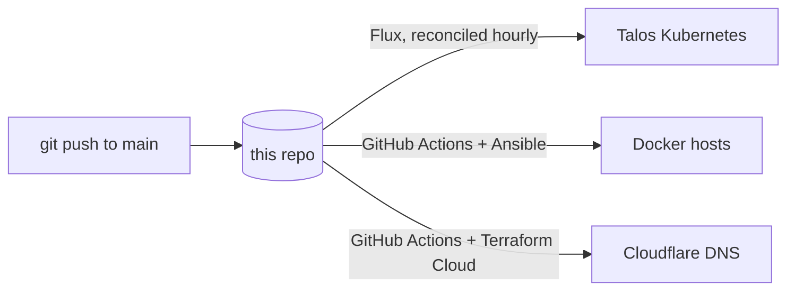

# homelab-infra

A self-hosted homelab managed entirely from Git. A Talos Kubernetes cluster is
reconciled by Flux, a set of Docker hosts is reconciled by Ansible, and public DNS is
managed with Terraform. Pushing to `main` is the only deploy step.

## Architecture

Three control planes, one repo:

- **Kubernetes** runs on a 3-node Talos Linux cluster. Flux watches this repo and
  applies the desired state on an interval, with pruning, so the cluster always matches
  Git.
- **Docker** runs on a Synology NAS and an Ubuntu VM. A self-hosted GitHub Actions
  runner triggers Ansible whenever anything under `ansible/` changes, which renders and
  brings up the Compose stacks on each host.
- **DNS** for the `khider.fr` zone is declared in Terraform and applied through
  Terraform Cloud. A GitHub Actions workflow plans on pull requests and applies on push
  to `main` whenever anything under `terraform/` changes.



## How it works

### Kubernetes (Flux)

Flux is bootstrapped from `clusters/homelab-prod/flux-system`, which defines the Git
source. Two Flux Kustomizations reconcile the rest of the repo every hour with
`prune: true`:

| Kustomization         | Path              | Contents                                    |
| --------------------- | ----------------- | ------------------------------------------- |
| `infrastructure-sync` | `./infrastructure`| Helm repositories, generic-device-plugin    |
| `apps-sync`           | `./apps`          | All application workloads                   |

Applications are deployed as Flux `HelmRelease` resources pinned to versioned Helm
repositories, so every upgrade is an explicit, reviewable change in Git.

### Docker (Ansible)

`.github/workflows/ansible-deploy.yaml` runs on a self-hosted runner and executes
`ansible/deploy-homelab.yml`. The playbook copies each stack's `docker-compose.yaml`
to the target host and runs `docker compose up`, idempotently, for two host groups
defined in `ansible/inventory.ini`.

### DNS (Terraform)

`terraform/cloudflare/` declares every record in the `khider.fr` Cloudflare zone: the
apex `A` record (pointed at the home IP, kept out of Git as a sensitive variable), the
per-service `CNAME`s (Authentik, Jellyfin, Sonarr, qBittorrent, Nextcloud, …), and the
mail records (MX, SPF, DKIM, DMARC). State and runs live in Terraform Cloud
(organization `Tarek-Corp`, workspace `cloudflare-terraform`).
`.github/workflows/terraform.yml` runs `terraform plan` on pull requests and
`terraform apply` on push to `main`, so DNS changes are reviewed before they go live.

## What's running

### On Kubernetes

| Component              | Role                                                          |
| ---------------------- | ------------------------------------------------------------- |
| Traefik                | Ingress controller and reverse proxy                          |
| cert-manager           | Automated TLS, issued through the Cloudflare DNS-01 challenge |
| Authentik              | SSO and identity, enforced in front of services via Traefik   |
| Grafana                | Dashboards                                                     |
| Jellyfin               | Media server, GPU transcoding via the device plugin below     |
| Sonarr / Prowlarr      | Media automation                                              |
| generic-device-plugin  | Exposes `/dev/dri` to the cluster for hardware transcoding     |
| Velero                 | Off-site backups of stateful workloads to Cloudflare R2       |
| khider.fr              | Personal static website (nginx), public at `khider.fr`        |

### On Docker

| Host             | Stacks                                            |
| ---------------- | ------------------------------------------------- |
| Ubuntu VM        | BIND (DNS), Nextcloud, Nginx Proxy Manager, Traefik |
| Synology NAS     | MariaDB, qBittorrent, Uptime Kuma                  |

## Secrets

Secrets are committed to Git as **Sealed Secrets**. The values are encrypted with the
cluster controller's public key and can only be decrypted in-cluster, so the repo is
safe to keep public. No plaintext credentials live in the tree or its history.

## Storage

Persistent volumes for the cluster are provisioned over iSCSI by the Synology CSI
driver (`synology-nas/syno-sc.yaml`).

## Backups

Velero backs up stateful workloads to a Cloudflare R2 bucket, so a copy of every
important volume lives off the NAS. Each backup takes a CSI snapshot on the Synology,
then the data mover streams the volume contents to R2 with Kopia, deduplicated and
incremental. Backup policy is declarative: every app that needs protection carries a
`backup-schedule.yaml` next to its manifests, reviewed and versioned like everything
else. Daily backups cover Authentik, n8n, and the media configs; Grafana runs weekly;
retention is 14 days. Prometheus data and stateless workloads are deliberately
excluded, since Flux rebuilds the latter from this repo. R2 credentials are committed
as a Sealed Secret like every other secret in the tree.

## Updates

Renovate runs continuously and opens pull requests to bump Helm charts, container
images, and GitHub Actions across the repo, so dependency upgrades stay small and
reviewable.

## Layout

```
.
├── clusters/homelab-prod/   # Flux bootstrap (Git source + sync)
├── infrastructure/          # cluster-wide infra, reconciled first
├── apps/                    # Helm-based application workloads
├── synology-nas/            # cluster storage class (Synology CSI)
├── terraform/cloudflare/    # Cloudflare DNS records (Terraform Cloud)
├── ansible/                 # Docker Compose stacks + playbook
│   ├── docker/              # per-host, per-stack compose files
│   ├── inventory.ini
│   └── deploy-homelab.yml
├── flux-apps.yaml           # Flux Kustomization: apps
├── infrastructure-sync.yaml # Flux Kustomization: infrastructure
└── renovate.json
```

## Roadmap

- Application-consistent database backups: pg_dump hooks for Authentik's Postgres
  ahead of the volume snapshot.
- Periodic restore drills to prove backups round-trip.
